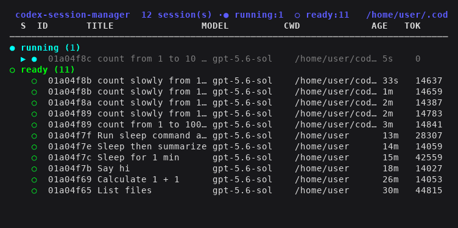
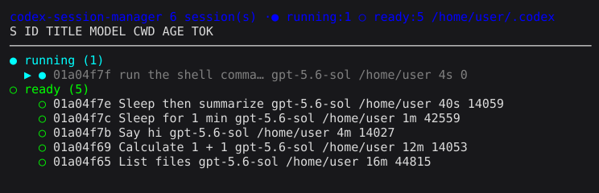

# codex-session-manager

Monitor and manage native [Codex](https://github.com/openai/codex) CLI sessions
in an interactive, tmux-detachable UI. Reads Codex's own session store — no
mocking, no scraping — and derives live status (running / ready / error) from
Codex's rollout event logs.





## Requirements

- Python 3.10+ (stdlib only — no pip dependencies)
- `tmux` (for detachable sessions)
- `codex` CLI on `PATH`

## Install

```bash
git clone <this-repo> ~/codex-session-manager
export PATH="$HOME/codex-session-manager:$PATH"   # or symlink codex-sm to ~/.local/bin
```

## Usage

```bash
codex-sm            # interactive UI (default)
codex-sm list       # one-shot table   (--json for JSON)
codex-sm status <id>      # one session (short id prefix OK)
codex-sm attach <id>      # resume <id> in tmux and switch to it
codex-sm new [prompt]     # start a fresh session in tmux
codex-sm delete <id>      # passthrough to `codex delete`
codex-sm --home /path     # override CODEX_HOME (default ~/.codex)
```

## Interactive UI

Sessions are **grouped by status**, auto-refreshed every 5s and auto-relocated
as status changes — a running session drops into `ready` when its turn
finishes, a failed one lands in `error`.

| key | action |
|-----|--------|
| `↑` `↓` / `j` `k` | move selection (skips group headers) |
| `g` / `G` | jump to top / bottom |
| `Enter` / `→` | enter the selected session (resume in tmux) |
| `n` | new session (optional seed prompt) |
| `r` | refresh now · `/` filter · `D` delete · `x` kill tmux |
| `?` | in-app help · `q`/`Esc` quit |

**In ↔ out:** `→` enters a session; inside a Codex session, `←` returns to the
menu — but only when the prompt is empty and the cursor sits at the input start,
so left-arrow cursor movement while editing still works normally.

Each session runs in its own tmux session (`codex-<id>`) behind the manager
(`codex-sm`), so detaching never stops your agents.

## How status is detected

`codex_sm/sessions.py` reads `~/.codex/state_*.sqlite` (`threads` table, the
same list `codex resume` uses) and each session's `rollout-*.jsonl`: the most
recent `task_started` turn without a matching `task_complete` ⇒ **running**, a
terminal `error` ⇒ **error**, else **ready** (mirrors Codex app-server
`ThreadStatus`). Read-only — no Codex internals are modified.

## Layout

```
codex-sm                 # launcher
codex_sm/
  cli.py        sessions.py     tmux_util.py     tui.py     left_or_exit.sh
```
